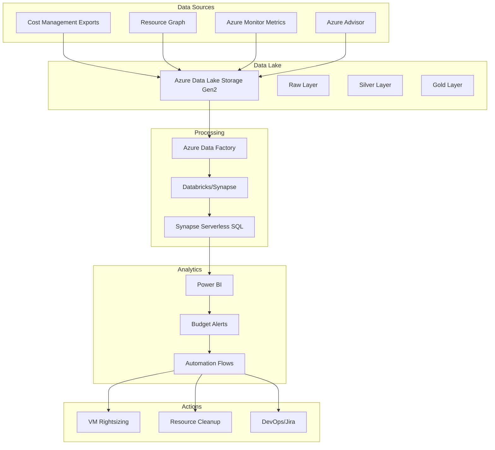
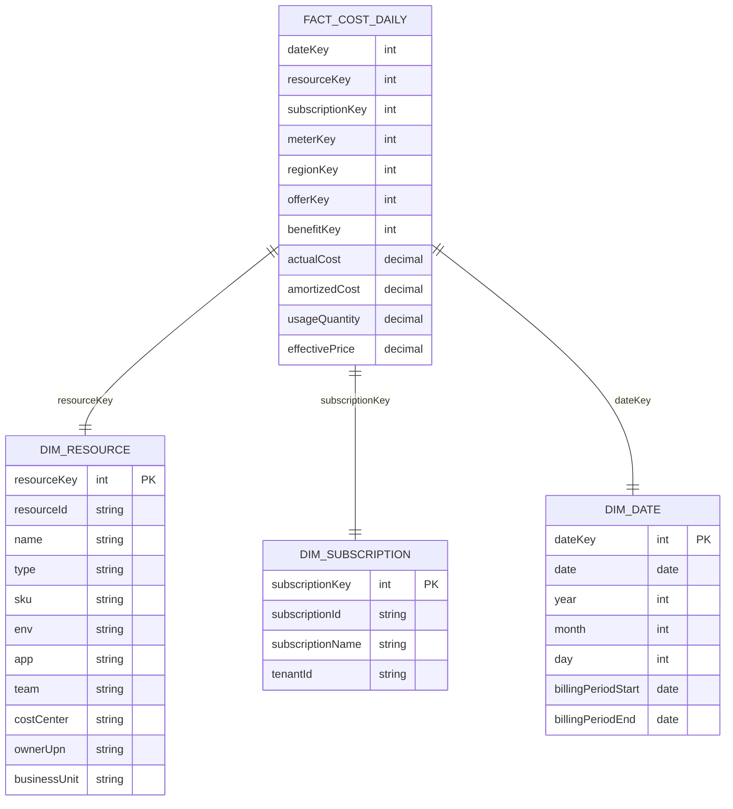

# Azure Cost Optimization & Cloud Spend Analytics Platform

A comprehensive cloud spend analytics and optimization platform built on Azure that provides near real-time visibility into costs, usage patterns, and actionable insights for FinOps teams and engineering organizations.

## 🎯 Overview

This platform ingests detailed Azure cost and usage data, enriches it with resource context and telemetry, and surfaces actionable insights through Power BI dashboards and automated alerts. It supports budgeting, anomaly detection, rightsizing recommendations, and proactive cost-saving actions aligned with FinOps best practices.

### Key Features

- **Single Source of Truth**: Unified view of Azure spend across subscriptions and tenants
- **Near Real-Time Visibility**: ≤24h latency for cost data and insights
- **Automated Alerts**: Proactive notifications for overspend, budget breaches, and anomalies
- **Rightsizing & Cleanup**: Automated detection and remediation of idle/underutilized resources
- **Forecasting**: Predictive analytics for 1-3 month spend projections
- **Reservation Optimization**: Coverage analysis and purchase recommendations

## 🏗️ Architecture

### High-Level Architecture



### Data Flow

1. **Ingestion**: Cost exports, resource inventory, and metrics are collected daily
2. **Transformation**: Data flows through bronze → silver → gold layers with incremental processing
3. **Analytics**: Power BI consumes curated data with star schema for optimal performance
4. **Automation**: Budget alerts and anomaly detection trigger automated remediation workflows

## 📊 Data Model

### Star Schema Design



## 🚀 Quick Start

### Prerequisites

- Azure subscription with Cost Management access
- Power BI Pro license
- Azure CLI 2.0+
- Bicep or Terraform
- Service Principal with required permissions

### Required Azure Roles

```bash
# Cost Management Reader (billing scope)
# Reader on subscriptions
# Monitoring Reader (for metrics)
# Advisor Reader
# Storage Blob Data Contributor (specific ADLS paths)
# Data Factory Contributor
```

### Deployment

1. **Clone the repository**
```bash
git clone https://github.com/your-org/azureanalyticshub.git
cd azureanalyticshub
```

2. **Set up environment variables**
```bash
export AZURE_SUBSCRIPTION_ID="your-subscription-id"
export AZURE_TENANT_ID="your-tenant-id"
export SERVICE_PRINCIPAL_ID="your-sp-client-id"
export SERVICE_PRINCIPAL_SECRET="your-sp-secret"
```

3. **Deploy infrastructure**
```bash
# Using Bicep
az deployment sub create \
  --location "East US" \
  --template-file infrastructure/main.bicep \
  --parameters @infrastructure/parameters/prod.json

# Or using Terraform
cd terraform
terraform init
terraform plan -var-file="prod.tfvars"
terraform apply
```

4. **Configure Cost Exports**
```bash
# Enable cost exports for each billing account
az cost-management export create \
  --name "daily-cost-export" \
  --scope "/providers/Microsoft.Billing/billingAccounts/{billingAccountId}" \
  --destination-account-id "{storageAccountId}" \
  --destination-container "cost-exports" \
  --destination-resource-group "{resourceGroupName}" \
  --definition-type "ActualCost" \
  --schedule-recurrence "Daily" \
  --schedule-recurrence-period from="2024-01-01" to="2024-12-31"
```

5. **Deploy Data Factory pipelines**
```bash
# Import and publish ADF pipelines
az datafactory pipeline create \
  --factory-name "{dataFactoryName}" \
  --resource-group "{resourceGroupName}" \
  --pipeline-name "cost-ingestion-pipeline"
```

6. **Configure Power BI**
- Connect to Synapse Serverless SQL endpoint
- Import semantic model
- Configure incremental refresh policy
- Set up row-level security (RLS)

## 📈 Key Performance Indicators

### Spend Metrics
- **Total Cost**: Actual vs Amortized spend tracking
- **Growth Rate**: Month-over-month and year-over-year trends
- **Cost Distribution**: By business unit, application, environment
- **Regional Spend**: Cost breakdown by Azure regions

### Efficiency Metrics
- **Reservation Coverage**: Percentage of compute costs covered by RIs
- **Savings Plan Utilization**: Effective use of Azure Savings Plans
- **Rightsizing Savings**: Potential vs realized savings from optimization
- **Idle Resources**: Percentage and cost of underutilized assets

### Forecasting
- **30/60/90-day projections** with confidence intervals
- **Budget burn rate** and end-of-month projections
- **Seasonal adjustments** for accurate forecasting

### Anomaly Detection
- **Daily variance analysis** by service and tag
- **Z-score calculations** for statistical anomaly detection
- **Threshold-based alerts** for significant cost spikes

## 🔧 Sample Queries

### Power Query (M) - Flatten Tags
```m
let
  Source = Csv.Document(File.Contents("<path>"),[Delimiter=",", Encoding=65001, QuoteStyle=QuoteStyle.Csv]),
  Promote = Table.PromoteHeaders(Source, [PromoteAllScalars=true]),
  TagsParsed = Table.TransformColumns(Promote, {{"tags", each if _ = null then null else Json.Document(_), type any}}),
  TagsToRows = Table.ExpandRecordColumn(TagsParsed, "tags", Record.FieldNames(TagsParsed{0}[tags]), Record.FieldNames(TagsParsed{0}[tags]))
in
  TagsToRows
```

### DAX - Core Measures
```DAX
Total Cost := SUM(fact_cost_daily[actualCost])

Amortized Cost := SUM(fact_cost_daily[amortizedCost])

MoM % :=
VAR Prev = CALCULATE([Total Cost], DATEADD('dim_date'[Date], -1, MONTH))
RETURN DIVIDE([Total Cost] - Prev, Prev)

Budget Remaining % := DIVIDE([Budget Amount] - [Total Cost], [Budget Amount])

Projected EOM Spend :=
VAR DaysElapsed = DAY(EOMONTH(TODAY(),0)) - DAY(EOMONTH(TODAY(),-1))
VAR DailyAvg = [Total Cost] / MAX('date_stats'[DayOfMonth])
RETURN DailyAvg * DaysElapsed

Daily zScore :=
VAR Mean = AVERAGEX(VALUES('dim_date'[Date]), [Total Cost])
VAR Std = STDEVX.P(VALUES('dim_date'[Date]), [Total Cost])
RETURN DIVIDE([Total Cost] - Mean, Std)
```

### Resource Utilization Analysis
```sql
SELECT 
    r.resourceId,
    r.name,
    r.type,
    AVG(u.cpu_pct) AS avg_cpu,
    COUNT(*) AS days_measured,
    SUM(f.actualCost) AS total_cost
FROM fact_utilization_daily u
JOIN dim_resource r ON r.resourceKey = u.resourceKey
JOIN fact_cost_daily f ON f.resourceKey = u.resourceKey
WHERE u.date BETWEEN DATEADD(day,-7,GETDATE()) AND GETDATE()
GROUP BY r.resourceId, r.name, r.type
HAVING AVG(u.cpu_pct) < 20 AND COUNT(*) >= 5
ORDER BY total_cost DESC;
```

## 🤖 Automation Workflows

### Budget Alerts
- **50/75/90/100% thresholds** with configurable action groups
- **Email, Teams, and webhook notifications**
- **Automated escalation** for budget breaches

### Rightsizing Actions
- **VM deallocation** for consistently low CPU usage
- **App Service plan downgrades** based on utilization
- **Storage tier optimization** for blob storage

### Cleanup Automation
- **Unattached managed disks** removal after N days
- **Orphaned snapshots** cleanup
- **Unused public IPs** deallocation
- **Empty resource groups** detection and cleanup

### Reservation Recommendations
- **Weekly analysis** of compute usage patterns
- **Purchase quantity recommendations** by service
- **Coverage optimization** for existing reservations

## 📊 Power BI Reports

### Executive Overview
- Total and amortized cost trends
- Month-over-month and year-over-year growth
- Budget vs actual with variance analysis
- Forecast with confidence intervals
- Reservation and Savings Plan coverage

### FinOps Operations Center
- Anomaly detection dashboard
- Top cost drivers and movers
- Waste tracking and optimization opportunities
- Tag compliance monitoring
- Budget burn rate analysis

### Engineering Owner View
- Cost breakdown by resource with utilization overlay
- Rightsizing recommendations list
- Resource lifecycle tracking
- Performance vs cost correlation

### Savings Analytics
- Reservation utilization and coverage
- Realized vs potential savings tracking
- Rightsizing impact measurement
- Cleanup action results

## 🔒 Security & Governance

### Access Control
- **Role-based access control (RBAC)** with least privilege
- **Privileged Identity Management (PIM)** for just-in-time elevation
- **Row-level security (RLS)** in Power BI by business unit/tag
- **Private endpoints** for all data services

### Data Protection
- **Encryption at rest** with customer-managed keys (optional)
- **Network isolation** with VNet integration
- **Audit logging** for all data access and pipeline runs
- **Data retention policies** (minimum 13 months)

### Tagging Governance
- **Azure Policy** enforcement for required tags
- **Tag compliance monitoring** and reporting
- **Remediation automation** for untagged resources
- **Cost allocation** by business unit and project

## 📋 Monitoring & Observability

### Pipeline Health
- **Data freshness monitoring** with SLA tracking
- **File completeness validation** per billing account
- **Schema drift detection** for cost exports
- **Reconciliation alerts** for invoice variance

### Performance Metrics
- **Refresh duration tracking** for Power BI datasets
- **Query performance monitoring** in Synapse
- **Storage utilization** and cost optimization
- **Automation success rates** and error tracking

## 🚨 Troubleshooting

### Common Issues

**Cost export not appearing**
```bash
# Check export status
az cost-management export show \
  --name "daily-cost-export" \
  --scope "/providers/Microsoft.Billing/billingAccounts/{billingAccountId}"
```

**Power BI refresh failures**
- Verify Synapse connectivity and permissions
- Check incremental refresh policy configuration
- Validate data model relationships and measures

**Pipeline failures**
- Review ADF activity logs for specific error messages
- Check service principal permissions
- Validate source data availability and format

### Support Resources
- [Azure Cost Management documentation](https://docs.microsoft.com/en-us/azure/cost-management-billing/)
- [Power BI incremental refresh guide](https://docs.microsoft.com/en-us/power-bi/connect-data/incremental-refresh-overview)
- [Azure Data Factory monitoring](https://docs.microsoft.com/en-us/azure/data-factory/monitor-using-azure-monitor)

## 🛣️ Roadmap

### Phase 1 (Weeks 1-2)
- [x] Infrastructure foundation with IaC
- [x] Cost export configuration
- [x] Data Lake setup and networking
- [x] Service principal and permissions

### Phase 2 (Weeks 3-5)
- [x] Data Factory pipeline development
- [x] Bronze to Silver transformation
- [x] Initial Power BI semantic model
- [x] Basic dashboard creation

### Phase 3 (Weeks 6-8)
- [x] Advisor and metrics enrichment
- [x] KPI implementation
- [x] Row-level security configuration
- [x] Budget alerts and notifications

### Phase 4 (Weeks 9-10)
- [x] Anomaly detection algorithms
- [x] Forecasting models
- [x] Rightsizing workflows
- [x] Ticketing system integration

### Phase 5 (Weeks 11-12)
- [x] Invoice reconciliation validation
- [x] FinOps showback reporting
- [x] Documentation and training
- [x] Production handoff

## 🤝 Contributing

1. Fork the repository
2. Create a feature branch (`git checkout -b feature/amazing-feature`)
3. Commit your changes (`git commit -m 'Add some amazing feature'`)
4. Push to the branch (`git push origin feature/amazing-feature`)
5. Open a Pull Request

### Development Guidelines
- Follow Azure naming conventions
- Include unit tests for new components
- Update documentation for new features
- Ensure all pipelines pass before merging

## 📄 License

This project is licensed under the MIT License - see the [LICENSE](LICENSE) file for details.

## 🙏 Acknowledgments

- Azure Cost Management team for export capabilities
- Power BI team for incremental refresh features
- FinOps Foundation for best practices guidance
- Community contributors and feedback

## 📞 Support

For support and questions:
- Create an issue in this repository
- Contact the FinOps team at your-org@company.com
- Join our internal Teams channel: #azure-cost-analytics

---

**Built with ❤️ by the FinOps Team**
